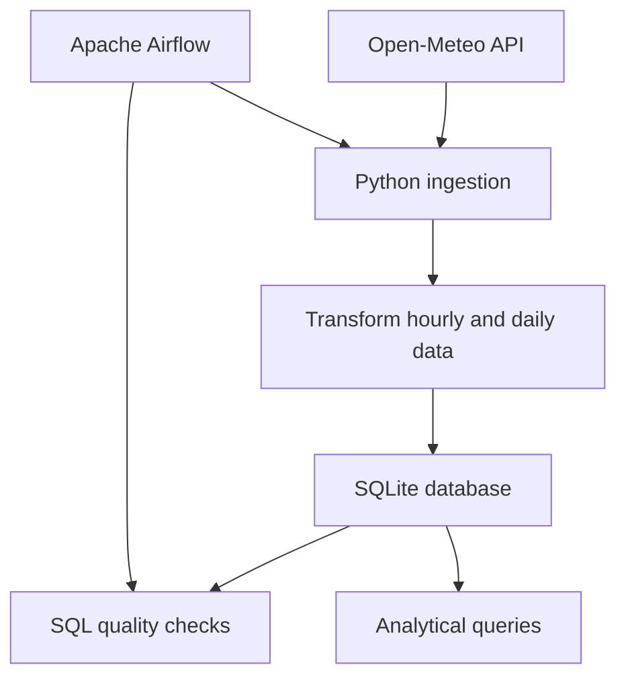
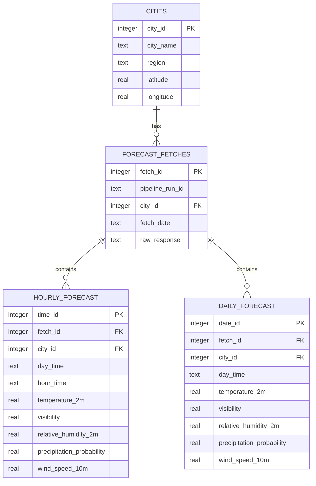

# Weather Data Pipeline


An end-to-end data engineering project that retrieves seven-day hourly weather forecasts from the [Open-Meteo API](https://open-meteo.com/), transforms the responses into hourly and daily datasets, and stores them in a relational SQLite database.

The pipeline is containerized with Docker and orchestrated by Apache Airflow. Airflow schedules hourly ingestion runs and executes data-quality checks after each successful load.

## Project goals

This project was built to practise the core components of a data pipeline:

- extracting data from an external REST API;
- transforming nested JSON responses with Python and pandas;
- designing a normalized relational data model;
- preserving raw source responses for traceability;
- validating data with SQL-based quality checks;
- packaging application code in a Docker image; and
- scheduling and monitoring containerized tasks with Apache Airflow.

## Architecture



Airflow runs two sequential Docker tasks:

1. **`fetch_weather`** calls the API, transforms the response, and loads the database.
2. **`run_quality_checks`** runs SQL assertions against the most recent forecast for each city.

The DAG runs hourly, does not backfill historical intervals, and allows only one active DAG run at a time to avoid concurrent writes to SQLite.

## Data flow

For every configured city, the ingestion process:

1. Requests seven days of hourly forecast data from Open-Meteo.
2. Retains the complete API response as JSON in `forecast_fetches`.
3. Converts the hourly arrays into a pandas DataFrame.
4. Separates the forecast timestamp into date and time fields.
5. Inserts 168 hourly forecast rows.
6. Aggregates the hourly values into seven daily rows.
7. Commits all cities as a single database transaction.

If an exception occurs before the transaction completes, SQLite rolls the load back. Each Airflow DAG run also passes its `run_id` into the ingestion container. A uniqueness constraint on `(pipeline_run_id, city_id)` prevents the same Airflow run from being stored twice for one city.

## Data model



The schema includes primary keys, foreign keys, uniqueness constraints, and range checks for weather measurements. The database itself is generated locally and is intentionally excluded from version control.

## Data-quality checks

After ingestion, the pipeline validates the latest forecast for every city. A quality check fails when its SQL query returns one or more rows.

| Check | Expected result |
|---|---:|
| Hourly record count | 168 rows per city |
| Daily record count | 7 rows per city |
| Forecast date range | 6 days between the first and last forecast date |

Failed checks raise an exception, causing the corresponding Airflow task to be marked as failed and retried according to the DAG configuration.

## Analytical queries

The `queries/` directory contains reusable SQL analyses for questions such as:

- Which cities have the highest temperature tomorrow?
- What are the daily minimum, maximum, and average temperatures?
- Which cities experience the largest intraday temperature swings?
- How many hours per day have a precipitation probability above 50%?
- Which city has the best conditions for outdoor activities over the next three days?
- How did a forecast change between its two most recent API fetches?
- Which cities have the most volatile forecasts over time?

The queries use joins, common aggregations, conditional aggregation, window functions, and comparisons between successive forecast runs.

## Repository structure

```text
weather-pipeline/
├── airflow/
│   ├── dags/
│   │   └── weather_pipeline_dag.py
│   └── docker-compose.yaml
├── config/
│   └── cities.yaml
├── data_quality/
│   ├── forecast_days.sql
│   ├── number_records_daily.sql
│   └── number_records_hourly.sql
├── queries/
│   ├── fc_change.sql
│   ├── fc_volatility.sql
│   ├── highest_temp.sql
│   ├── min_max_temps.sql
│   ├── outdoor_act.sql
│   ├── prec_prob.sql
│   └── temp_swing.sql
├── create_tables.sql
├── data_quality.py
├── fetch_weather_data.py
├── run_pipeline.py
├── run_queries.py
├── Dockerfile
└── requirements.txt
```

Generated databases, Airflow logs, local Airflow configuration, environment files, notebooks, and Python cache files are excluded from version control.

## Running the pipeline locally

### Prerequisites

- Python 3.13 or a compatible recent Python version
- Docker Desktop, if running the containerized pipeline or Airflow
- Git

No API key is required for the Open-Meteo forecast endpoint used by this project.

### 1. Clone the repository

```bash
git clone https://github.com/BenjaminCereda/weather-pipeline.git
cd weather-pipeline
```

### 2. Create the data directory

The SQLite file is created automatically, but its parent directory must exist:

```bash
mkdir data
```

### 3. Install the Python dependencies

```bash
python -m venv .venv
```

Activate the environment on Windows PowerShell:

```powershell
.\.venv\Scripts\Activate.ps1
```

Or on macOS/Linux:

```bash
source .venv/bin/activate
```

Then install the dependencies and run the complete pipeline:

```bash
pip install -r requirements.txt
python run_pipeline.py
```

This creates `data/weather.db`, retrieves the forecasts, loads all tables, and runs the data-quality checks.

## Running with Docker

Build the application image from the repository root:

```bash
docker build -t weather-pipeline .
```

Run it with the local `data/` directory mounted into the container.

Windows PowerShell:

```powershell
docker run --rm --mount type=bind,source="${PWD}\data",target=/app/data weather-pipeline
```

macOS/Linux:

```bash
docker run --rm --mount type=bind,source="$(pwd)/data",target=/app/data weather-pipeline
```

The bind mount keeps `weather.db` on the host after the container exits.

## Running with Airflow

The Airflow deployment uses Docker Compose with PostgreSQL for Airflow metadata, Redis as the message broker, and the Celery executor. The Airflow worker launches the pipeline image through Docker's local socket.

First build the `weather-pipeline` image as described above. Then create `airflow/.env` with the local settings required by Docker Compose:

```env
AIRFLOW_UID=50000
WEATHER_DATA_HOST_PATH=C:/absolute/path/to/weather-pipeline/data
FERNET_KEY=replace_with_a_generated_fernet_key
```

`WEATHER_DATA_HOST_PATH` must be an absolute host path because the Docker operator bind-mounts this directory into each pipeline container.

Generate a Fernet key with:

```bash
python -c "from cryptography.fernet import Fernet; print(Fernet.generate_key().decode())"
```

Start Airflow from the `airflow/` directory:

```bash
cd airflow
docker compose up airflow-init
docker compose up -d
```

Open [http://localhost:8080](http://localhost:8080), sign in with the default local-development credentials `airflow` / `airflow`, enable the `weather_pipeline` DAG, and trigger it manually or wait for its hourly schedule.

To stop the Airflow services without deleting their persistent metadata volume:

```bash
docker compose down
```

## Configuring cities

Cities are configured in `config/cities.yaml` as `[name, latitude, longitude]`:

```yaml
cities:
  - [Vienna, 48.2082, 16.3738]
  - [Taipei, 25.0330, 121.5654]
  - [Delhi, 28.6448, 77.21672]
```

Changing this file requires rebuilding the application image before the change appears in Docker or Airflow:

```bash
docker build -t weather-pipeline .
```

## Running an analytical query

`run_queries.py` exposes a small helper that returns the result of any SQL file as a pandas DataFrame:

```python
from run_queries import run_query

result = run_query("queries/min_max_temps.sql")
print(result)
```

## Current scope and possible extensions

This is a local learning and portfolio project rather than a production deployment. Natural next steps include:

- structured application logging;
- automated Python and SQL tests;
- continuous integration with GitHub Actions;
- a dashboard for exploring current forecasts and historical forecast changes;
- replacing SQLite with PostgreSQL for concurrent or larger workloads;
- deploying the scheduler and database to cloud infrastructure.

